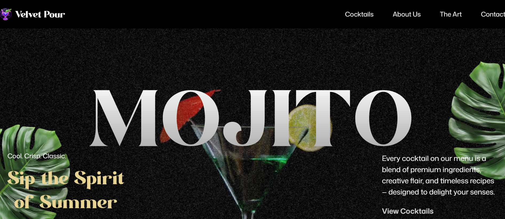

# 🍸 Velvet Pour — Cocktail App

A beautifully animated cocktail-themed web app built with **React**, **Tailwind CSS**, and **GSAP**, showcasing premium drink experiences through sleek UI, smooth animations, and responsive design.

---

## 🔮 Live Demo

👉 [https://cocktail-app-g21u.vercel.app](https://cocktail-app-g21u.vercel.app)

---

## 🧪 Tech Stack

- ⚛️ **React** — Component-based UI
- 🎨 **Tailwind CSS** — Utility-first responsive styling
- 🧿 **GSAP** — Scroll-triggered animations
- 🚀 **Vercel** — Seamless CI/CD deployment
- 🌐 **HTML5 + CSS3 + JavaScript (ES6)**

---

## ✨ Features

- ✅ **Animated Hero Section** with GSAP
- ✅ Responsive layout for desktop and mobile
- ✅ Component-based architecture (e.g., `Contact`, `Navbar`, `CocktailList`)
- ✅ Tailwind for fast UI styling
- ✅ Deployed to Vercel with custom domain support

---

## 🖼️ Preview

> “Sip the Spirit of Summer” — immersive landing section with hero visuals and motion.

---

## 📁 Folder Structure

